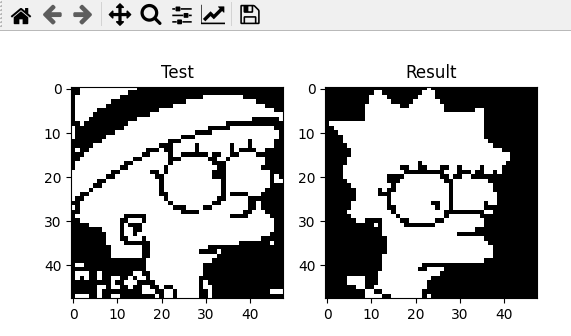

# Image recognition using the Hopfield Network

_Image recognition of The Simpsons using the Hopfield network. An implementation with Python._

## Built with 🛠️

* [OpenCV-python](https://github.com/opencv/opencv-python)
* [Numpy](https://numpy.org/)
* [Neurolab](https://pypi.org/project/neurolab/)
* [Matplotlib](https://matplotlib.org/)

## Screenshot 📖

---
⌨️ with ❤️ by [hrypasato](https://github.com/hrypasato) 😊